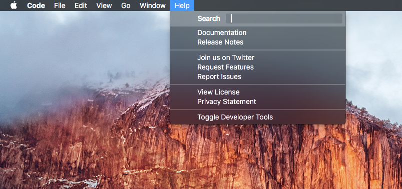
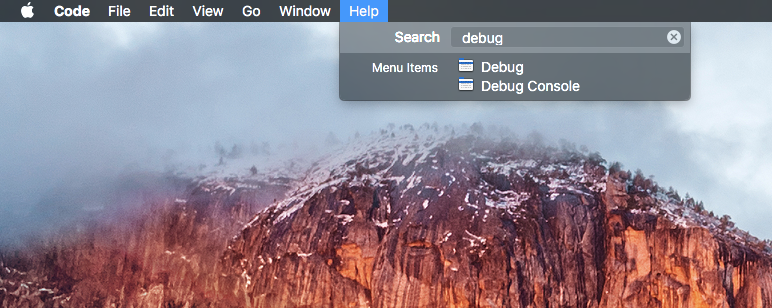
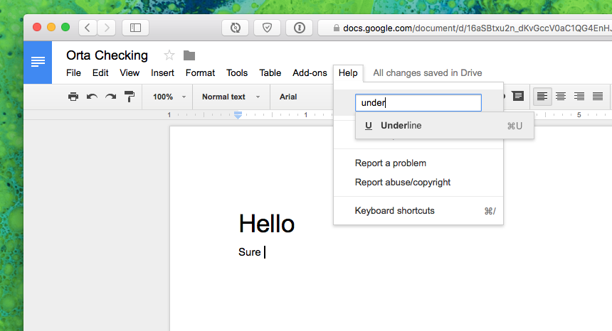

# keyboard_shortcuts

Notes on Keyboard Shortcuts for the Mac. Oriented towards technical but not programmers.

# Using a Mac

The Mac has a standard set of keyboard shortcuts, that are generally consistent across all apps. Not only
are they consistent across apps, but websites try to be consistent with those too. So a lot of the commands
you learn for your Mac will work in Google Docs for example.  

So let's start off by looking at the most useful key command of all time. `Command + Shift + ?`.



You can then start typing to find the menu item you want.



This also works in Google Docs! Though the command is a little different `Option + /`



Once you have that down, you can slowly memorize individual bits.

###Window Management

We need to handle windows all the time, they show our stuff.

```
Command + w - Close window, or tab.
Command + t - New Tab
Command + Shift + [ & ] - Switch between tabs. Not every app supports this.
```

Note that `Command + w` is not Quit, which is `Command + q`. This will close one window, or tab, whereas Quit, quits them all. 

### Text Management

```
Command + c - Copy
Command + v - Paste

Alt + Left / right - Jump between words.
Apple + Left / Right - Jump to the ends of the line.
Apple + Delete - Delete all the words till it hits the left edge.
``` 

### Operating System:

You have a few key commands that can do useful things in the Operating System, the most useful of this is 
the search command.

```
Command + Space - Spotlight Search, then up / down and enter to select.
Command + Tab - Application selector, I hold command and press left / right. You can tap Q on an app to close it from here.
Command + ` - Switch between windows in the current application
```


### Document Management

```
Command + s - Save.
```

### Searching inside an App

```
Command + e - Throw selected text into search.
Command + Shift + e - Throw selected text into replace.
Command + g - Find the next whatever, repeat to move to next.
```

Other Keyboard Shortcuts:

- [Chrome](chrome.md)
- [Slack](slack.md)
- [Advanced Windows](advanced-windows.md)
- [Clipboard History](clipboard-history.md)