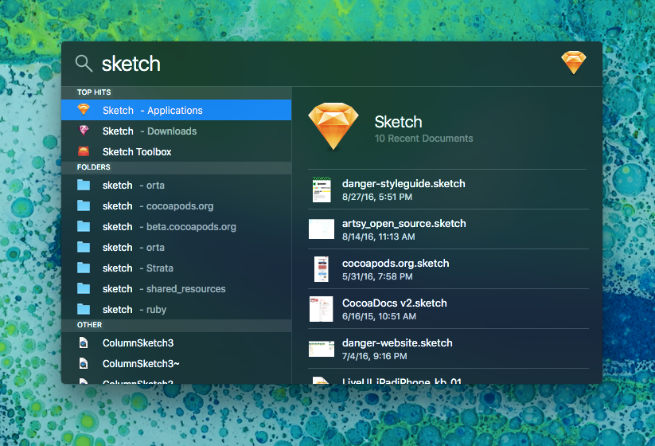

# keyboard_shortcuts

Notes on Keyboard Shortcuts for the Mac. Oriented towards technical but not programmers.

# Using a Mac

The Mac has a standard set of keyboard shortcuts, that are generally consistent across all apps. Not only
are they consistent across apps, but websites try to be consistent with those too. So a lot of the commands
you learn for your Mac will work in Google Docs for example.  

So let's start off by looking at the most useful key command of all time. `Command + Shift + ?`.


You can then start typing to find the menu item you want.


This also works in Google Docs! Though the command is a little different `Option + /`


Once you have that down, you can slowly memorize individual bits.

###Window Management

We need to handle windows all the time, they show our stuff.

```
Command + w - Close window, or tab.
Command + t - New Tab
Command + Shift + [ & ] - Switch between tabs. Not every app supports this.
```

Note that `Command + w` is not Quit, which is `Command + q`. This will close one window, or tab, whereas Quit, quits them all. 

### Text Management

```
Command + c - Copy
Command + v - Paste
Command + z - Undo
Command + Shift + z - Redo

Alt + Left / right - Jump between words.
Command + Left / Right - Jump to the ends of the line.
Command + Delete - Delete all the words till it hits the left edge.
``` 

Holding shift during those commands will expand the selection during that jump.

### Operating System:

You have a few key commands that can do useful things in the Operating System, the most useful of this is 
the search command.

```
Command + Space - Spotlight Search, then up / down and enter to select.
Command + Tab - Application selector, I hold command and press left / right. You can tap Q on an app to close it from here.
Command + ` - Switch between windows in the current application
```

### Taking a Screenshot

Pressing `Command + Shift + 4` will turn your mouse into a crosshair. Clicking and dragging will take a screenshot of whatever is
inside the rectangle that appears. If you are planning on taking a picture of a window, press `Spacebar` and it turns into a camera
which highlights the window your mouse is over.

### Document Management

```
Command + s - Save.
```

### Searching inside an App

```
Command + e - Throw selected text into search.
Command + Shift + e - Throw selected text into replace.
Command + g - Find the next whatever, repeat to move to next.
```

### Searching your Mac

If you want to open an app, or access a file, Spotlight is a great way to do it:

Press `Command + Space`:


You can then start typing:



Things to note:

* You can use this for files
* If you use this for an app, the most recent documents are in the right half. Press tab to jump to them.
* I use this for the [dictionary all the time](images/spotlight-extra.png)

# Other Keyboard Shortcuts:

- [Chrome](chrome.md)
- [Slack](slack.md)
- [Advanced Windows](advanced-windows.md)
- [Clipboard History](clipboard-history.md)
- [Recent Files](recent-files.md)