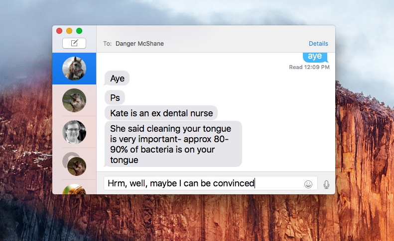
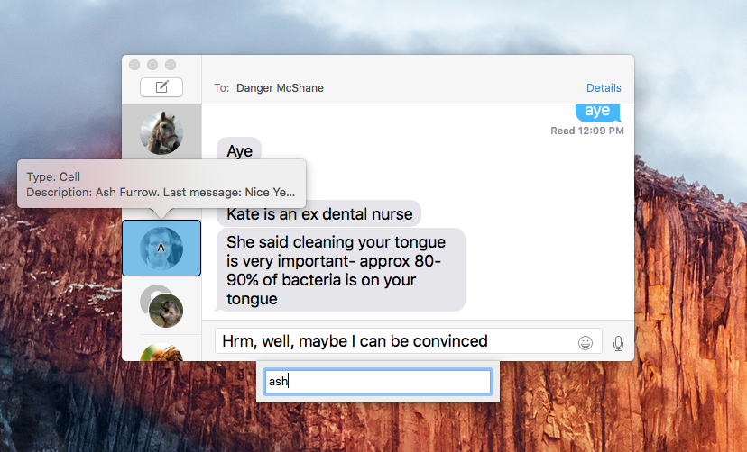
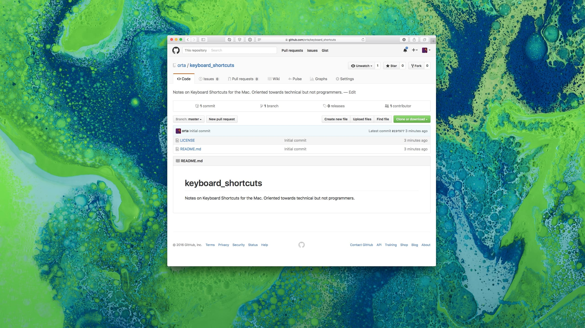
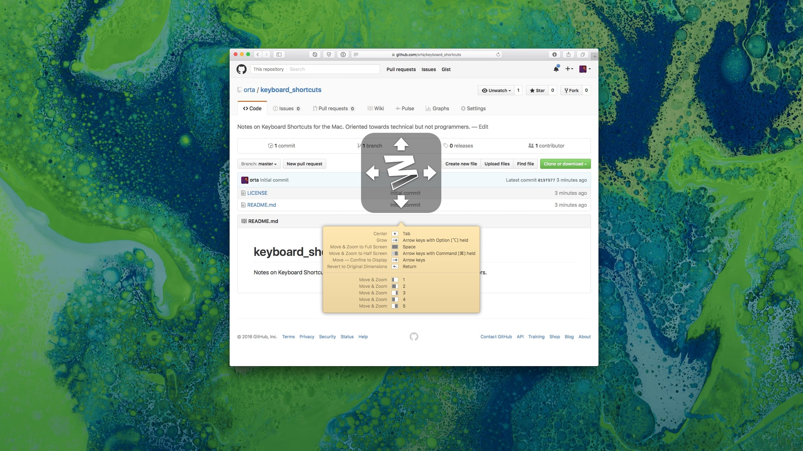
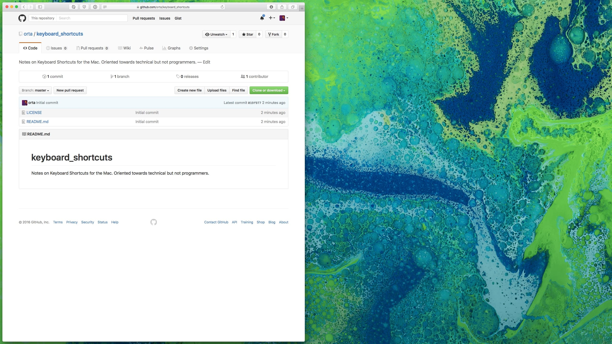

#### Jumping to something specific

If you like this form of skipping the mouse, [ShortCat](https://shortcatapp.com) is an app that applies it on every app (ironically, except for Chrome.) Instead you type the name of something.

For example here I am wanting to send a message to Ash, I press `ctrl + enter` and type Ash, now when I press `return` it clicks his face.

#### ShortCat before

#### ShortCat after

### Moving Windows around

I use [Moom](http://manytricks.com/moom/) to handle my window management, it's cheap and simple. It will help you move windows around very efficiently. Especially if you love a good grid.

Here's my messy window:

I press the Moom button:

I press, go take up the left half of the screen

This greatly simplifies moving things around, and if you want you can still use the mouse there.