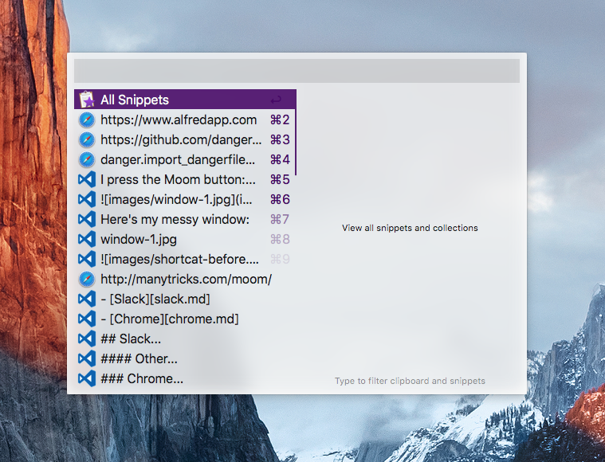
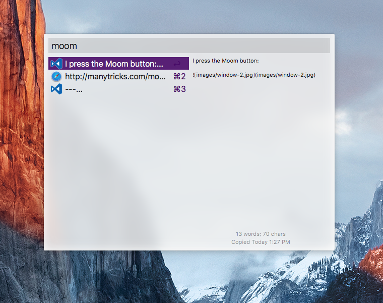

### Re-writing things

I try to avoid repeating myself by using a clipboard manager. I use [Alfred](https://www.alfredapp.com) for this.

So what do I mean? Well, every time I have done `Command + c` the thing has been placed inside a list of all things. 
It could be text, a file, an image, a URL, anything. Then I can press `Command + Shift + c` and I'm given this list:

 
 I can then search through this list by typing, this is everything I've copied in relation to writing [about Moom](advanced-windows.md)

It's got _years_ worth of history, so in theory as long as I can remember something that I copied - I can get it all.
