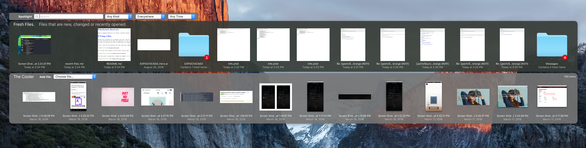

### Accessing Recent Files

So, weirdly enough this is a mouse-driven recommendation, but it requires a keyboard to start it up.

When I want to share a file, or move a screenshot, I use [Fresh](http://www.ironicsoftware.com/fresh/) to bring my most recently changed files 
to the front of my screen. So for example, if I press it now:

I get to see a live look at what files I've recently saved, and a collection of ones that I've kept around and decided they might be useful later. 
I then drag the files out and drop them into Slack, or Twitter, or an Email. Whatever, it's a really easy way to get to the most recently changed files.

